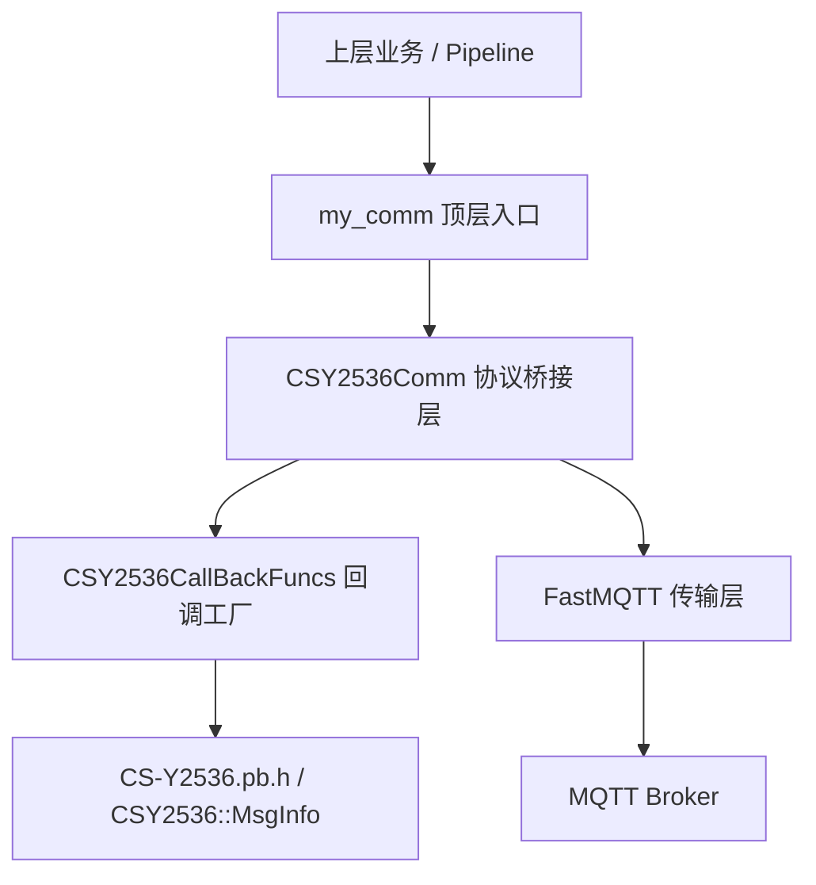
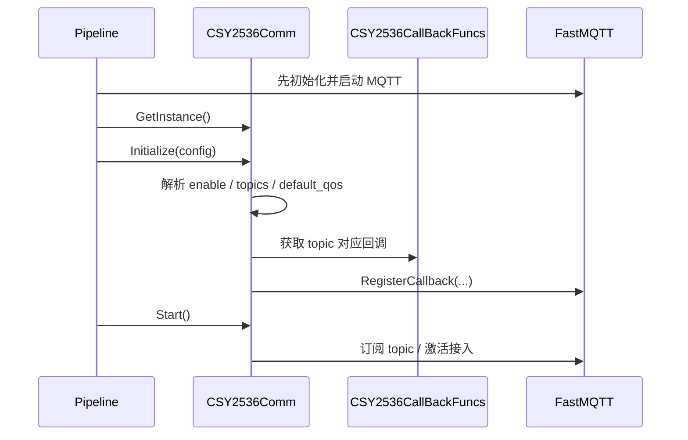
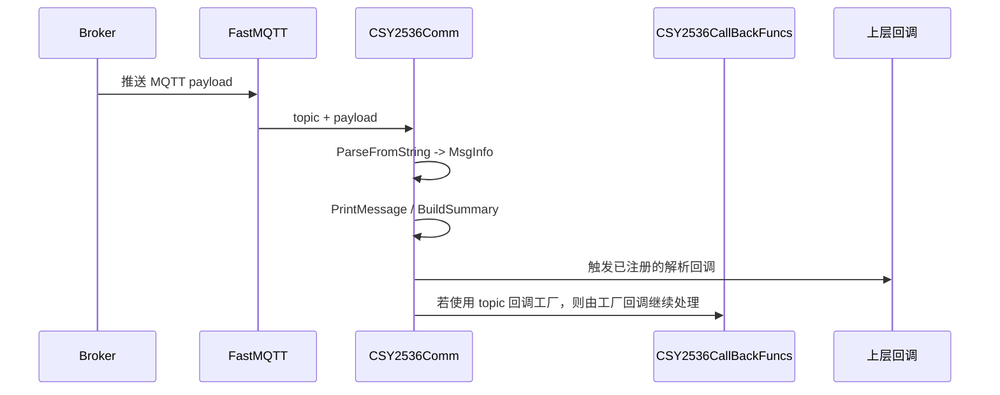

# my_comm 模块设计文档

**版本：** V1.0  
**所属工程：** fast_cpp_server  
**模块路径：** `src/util/my_comm/`  
**文档目标：** 说明当前 `my_comm` 模块的实际设计、职责边界与演进方向；本文档只描述设计，不修改代码。

---

## 1. 背景

`my_comm` 是工程中的通信抽象层，目标是把“外部消息如何接入系统”统一收口到一个模块内。结合当前代码现状来看，它不是一个已经完全成型的统一通信框架，而是一个已经搭好顶层壳、并在 MQTT 方向率先落地的通信模块集合。

当前工程里真正工作的部分主要集中在 `mqtt/2536pb/` 子目录：

- `CSY2536Comm` 负责协议接入、主题注册、生命周期控制和消息分发；
- `CSY2536CallBackFuncs` 负责按 topic 生成回调函数；
- 底层消息收发由 `FastMQTT` 完成；
- 协议载荷使用 `CS-Y2536.pb.h` 中定义的 `CSY2536::MsgInfo`。

从系统使用方式看，上层业务并不直接操作 MQTT 连接，而是通过 `CSY2536Comm` 进入这条链路。`Pipeline.cpp` 已经直接调用 `CSY2536Comm::GetInstance()`，说明这个模块已经进入运行流程，而不是纯预留代码。

---

## 2. 目标

`my_comm` 的设计目标可以概括为四点：

1. 统一接入入口
   - 为上层业务提供一个稳定的通信访问点，避免业务层直接依赖传输细节。

2. 协议与传输分离
   - `FastMQTT` 只负责 MQTT 字节传输，不关心 protobuf 语义；
   - `my_comm` 的协议层负责把 payload 转成 `CSY2536::MsgInfo`。

3. topic 驱动的消息分发
   - 不同 topic 可以绑定不同回调；
   - 业务逻辑通过回调挂载到协议桥接层，而不是散落到各处。

4. 保留扩展空间
   - `http/` 目录预留给 HTTP 通信适配；
   - `mqtt/json/` 目录预留给 JSON 形式的 MQTT 适配；
   - 当前先把 MQTT + CS-Y2536 这条链路做实。

---

## 3. 分层

当前 `my_comm` 的结构可以按四层理解。

### 3.1 顶层入口层

`src/util/my_comm/MyComm.h` 和 `src/util/my_comm/MyComm.cpp` 当前还是空壳。它们在架构上的意义是预留一个统一入口，未来可以把不同协议适配器收口到这一层。

当前它还没有承担实际路由职责，所以不能把它理解为已经完成的总调度器。它更像是一个未来 facade 的占位符。

### 3.2 协议桥接层

`CSY2536Comm` 是当前最核心的模块。它负责：

- 读取初始化配置；
- 判断模块是否启用；
- 启动和停止协议接入；
- 维护 topic 列表和回调列表；
- 订阅 / 取消订阅 MQTT topic；
- 解析原始 payload 为 `CSY2536::MsgInfo`；
- 打印消息摘要和调试信息；
- 把解析后的消息分发给上层注册回调。

它的角色不是消息内容的最终业务处理者，而是一个“协议适配 + 分发”中间层。

### 3.3 回调工厂层

`CSY2536CallBackFuncs` 是一个单例回调工厂。它的职责是：

- 根据 topic 生成一个 `fast_mqtt::MessageCallback`；
- 在回调内部统一完成 protobuf 解析；
- 为不同 topic 提供不同的处理分支；
- 统一日志输出格式。

它把“topic 对应什么处理逻辑”从 `CSY2536Comm` 中剥离出来，避免协议桥接层同时承担过多 topic 细节。

### 3.4 传输层

`FastMQTT` 是底层消息传输模块，负责 MQTT 连接、订阅、发布、回调调度和状态统计。它不理解 `CSY2536::MsgInfo` 的语义，只处理字节流和 topic。

也就是说，`my_comm` 依赖 `FastMQTT`，但不反向绑定它的内部实现。

---

## 4. 接口

### 4.1 顶层入口接口

当前顶层 `MyComm` 仍未形成可用接口，因此从设计上它的职责是预留统一入口，而不是立即对外承载业务能力。

### 4.2 CSY2536Comm 的主要接口

| 接口 | 作用 | 当前设计理解 |
| --- | --- | --- |
| `GetInstance()` | 获取单例 | 整个模块只保留一个实例，作为唯一访问点 |
| `Initialize(const nlohmann::json&)` | 初始化配置 | 读取 enable、topics、default_qos 等参数，并准备 topic 列表 |
| `Start()` | 启动模块 | 在 FastMQTT 已就绪后注册订阅和回调 |
| `Stop()` | 停止模块 | 反注册主题，释放运行态资源 |
| `RegisterParsedCallback(...)` | 注册解析后的回调 | 让上层在“已解析 MsgInfo”层面接入业务 |
| `ClearTopic(...)` | 清理单个主题 | 解除某个 topic 下的所有回调和订阅 |
| `ClearAll()` | 清理全部主题 | 用于模块整体重置或停止 |
| `GetStatus()` | 查询状态 | 向上层暴露模块运行状态及底层传输状态 |
| `RegisterCallbackToFastMQTT(...)` | 向 FastMQTT 注册回调 | 这是桥接封装，不是业务接口 |
| `Setting2536CallbackForTopic()` | 为特定 topic 绑定默认回调 | 当前属于占位式 topic 注册逻辑 |

### 4.3 CSY2536CallBackFuncs 的主要接口

| 接口 | 作用 | 当前设计理解 |
| --- | --- | --- |
| `GetInstance()` | 获取单例 | 保证回调工厂的唯一性 |
| `GetCallbackForTopic(const std::string&)` | 按 topic 获取回调 | 对外提供 topic 到 `MessageCallback` 的映射 |
| `BuildCallback(...)` | 构造实际回调 | 在闭包里完成解析、日志和 topic 分支处理 |
| `BuildSummary(const CSY2536::MsgInfo&)` | 生成消息摘要 | 用于统一打印消息要点 |
| `LogParsedMessage(...)` | 输出解析日志 | 负责标准化日志格式 |

### 4.4 上层集成接口

当前上层主要通过 `Pipeline::Launch2536Comm()` 接入该模块。也就是说，模块的集成方式不是“自动扫描加载”，而是由启动编排层显式调用。

---

## 5. 时序

当前消息链路可以拆成初始化时序和消息处理时序两部分。

### 5.1 初始化时序

### 5.2 消息处理时序

### 5.3 运行时顺序约束

当前实现隐含了一个明确顺序：

1. 先把 `FastMQTT` 启动起来；
2. 再初始化 `CSY2536Comm`；
3. 再执行 `Start()`；
4. 最后完成 topic 订阅和回调挂载。

这个顺序说明 `my_comm` 不负责创建传输层，它只消费已就绪的传输能力。

---

## 6. 扩展性

`my_comm` 当前的扩展点是明确的，但还没有完全收口。可以从三个方向看它的可扩展能力。

### 6.1 协议扩展

当前实现围绕 CS-Y2536 展开。未来如果要支持新的 protobuf 协议，可以沿用同样的模式：

- 一个协议桥接类负责初始化、订阅和消息分发；
- 一个回调工厂负责 topic 到回调的映射；
- 一个协议解析层负责 `payload -> MsgInfo` 或其他消息结构的转换。

### 6.2 传输扩展

`http/` 目录为空，说明当前设计已经预留出“非 MQTT 传输方式”的位置。也就是说，未来如果需要 HTTP 长轮询、Webhook 或其他上行通道，可以在顶层入口下挂新的子模块，而不是把现有 MQTT 实现硬塞进同一个类里。

### 6.3 业务扩展

现在 `CSY2536Comm` 里已经提供了解析后回调注册能力，这意味着业务不必直接碰原始 payload。未来上层可以注册多个解析回调，把同一份 `MsgInfo` 分发给不同业务对象。

---

## 7. 风险

当前设计能跑通主链路，但也存在几个明显风险点。

### 7.1 顶层 facade  هنوز未落地

`MyComm` 目前还是空壳，所以“统一通信入口”的抽象还没有真正形成。现在看起来像一个统一模块，实际上核心能力仍然集中在 `mqtt/2536pb`。

### 7.2 回调工厂与桥接层职责有重叠

`CSY2536Comm` 和 `CSY2536CallBackFuncs` 都在参与 topic 处理与消息分发，边界还不够干净。长期看这会导致：

- topic 逻辑分散；
- 初始化路径不够直观；
- 后续扩展时更容易出现重复注册或重复解析。

### 7.3 当前 topic 注册逻辑仍是占位式写法

`Setting2536CallbackForTopic()` 目前是硬编码 topic，并重复注册同一个回调多次，这说明它更像是“接入样例”或“占位实现”，还不是一个完整的 topic 路由系统。

### 7.4 回调缓存没有真正启用

`CSY2536CallBackFuncs` 中的缓存命中逻辑目前没有真正启用，这会导致每次获取 topic 回调时都重新构建，失去工厂缓存的意义。

### 7.5 顶层文档与实现命名需要统一

当前仓库里已经存在 `my_comm`、`my_csy2536_protocol`、`my_fast_MQTT` 等命名，后续如果继续演进，需要进一步统一命名边界，否则文档和代码容易出现“概念一致、目录不一致”的问题。

---

## 8. 结论

如果只按当前代码现状来定义，`my_comm` 的真实形态可以总结为：

- 它是系统通信的统一入口预留层；
- 当前真正落地的是 MQTT + CS-Y2536 这条链路；
- `CSY2536Comm` 是协议桥接核心；
- `CSY2536CallBackFuncs` 是 topic 回调工厂；
- `FastMQTT` 只承担传输职责；
- 上层通过 `Pipeline` 显式接入。

因此，这个模块的正确理解不是“顶层设计已经完全完成”，而是“统一通信框架的壳已经建立，MQTT 协议链路已经落地，HTTP 与更完整的顶层 facade 仍待补齐”。

如果后续继续重构，建议优先把三件事理顺：

1. 顶层 `MyComm` 的 facade 职责；
2. `CSY2536Comm` 与 `CSY2536CallBackFuncs` 的边界；
3. topic 注册与缓存机制的正式化。
